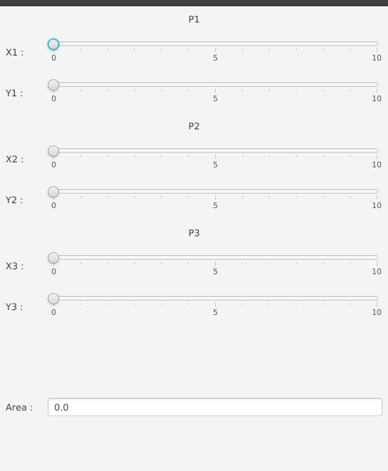
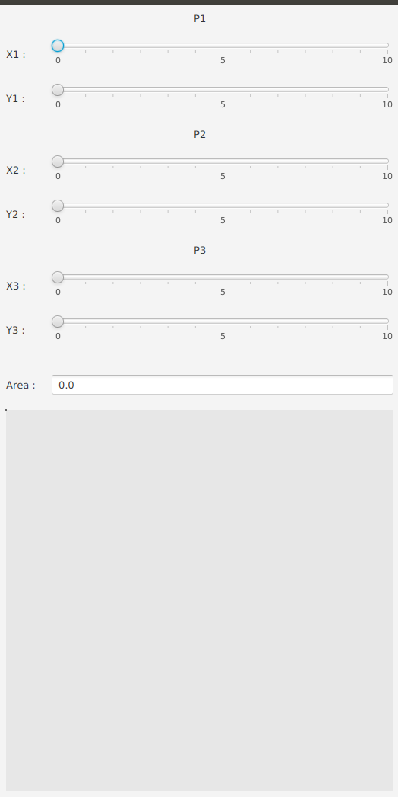

#  Introduction aux IHM en Java 

### IUT d’Aix-Marseille – Département Informatique Aix-en-Provence

* **Cours:** [M2105](http://cache.media.enseignementsup-recherche.gouv.fr/file/25/09/7/PPN_INFORMATIQUE_256097.pdf)
* **Responsable:** [Sébastien NEDJAR](mailto:sebastien.nedjar@univ-amu.fr)
* **Enseignants:** [Sébastien NEDJAR](mailto:sebastien.nedjar@univ-amu.fr), [Cyril Pain-Barre](mailto:cyril.pain-barre@univ-amu.fr)
* **Besoin d'aide ?**
    * La page [Piazza de ce cours](https://piazza.com/univ-amu.fr/spring2017/m2105/home).
    * Consulter et/ou créér des [issues](https://github.com/IUTInfoAix-M2105/tp1/issues).
    * [Email](mailto:sebastien.nedjar@univ-amu.fr) pour une question d'ordre privée, ou pour convenir d'un rendez-vous physique.

## TP 3 :  Propriétés, Binding et le FXML 

JavaFX 8.0 regroupe un ensemble d'API de Java 8 Standard Edition permettant le développement rapide d'applications 
graphiques modernes (aussi bien que des jeux 3D !). JavaFX 8.0 est tellement riche que sa 
[documentation](https://docs.oracle.com/javase/8/javafx/api/toc.htm) se trouve à part de celle de 
[Java 8](https://docs.oracle.com/javase/8/docs/api/index.html?overview-summary.html) (qui inclut celle de ses prédécesseurs AWT et Swing), bien qu'il fasse partie intégrante de Java 8.

Ce TP explore les mécanismes clefs de JavaFX 8.0 : Les propriétés, les bindings et le FXML.

#### Création de votre fork du TP

La première chose que vous allez faire est de créer un fork d'un dépôt. Pour ce faire, rendez-vous sur le lien suivant : 

[https://classroom.github.com/assignment-invitations/7b8195619f19f3cac8b1b6a310956f6f](https://classroom.github.com/assignment-invitations/7b8195619f19f3cac8b1b6a310956f6f) 

Comme pour le TP1, GitHub va vous créer un dépôt contenant un fork du dépôt 'IUTInfoAix-m2105/tp3' et s'appellant 'IUTInfoAix-m2105/tp3-votreUsername'. 
Vous apparaîtrez automatiquement comme contributeur de ce projet pour y pousser votre travail.

Une fois votre fork créé, il vous suffit de l'importer dans IntelliJ.

### Première étape : découvertes des propriétés et des bindings

#### Exercice 1

En Java, une propriété est un élément d'une classe que l'on peut manipuler à l'aide de getters (lecture) et 
de setters (écriture). Les propriétés sont généralement représentées par des attributs de la classe mais elles pourraient 
aussi être stockées dans une base de données ou autre système d'information.

Classiquement la convention dite *"JavaBeans"*, définie qu'une classe possédant une propriété nommée `XXX` doit avoir une 
méthode `getXXX()` et `setXXX()`. En plus de ces méthodes, les propriétés JavaFX possèdent une troisième méthode 
`XXXProperty()` qui retourne un objet qui implémente l'interface `Property`.

Intérêt des propriétés :

- Elles peuvent déclencher un événement lorsque leur valeur change et un gestionnaire d'événement (`Listener`) peut réagir en conséquence.

- Elles peuvent être liées entre-elles (Binding), c.-à-d. que le changement d'une propriété entraîne automatiquement la mise à jour d'une autre.

Pour simplifier la vie du développeur, la plateforme Java offreoffre des classes permettant de créer de telles propriétés 
facilement pour les types les plus courants (des types primitifs, les chaînes de caractères, certaines collections ainsi 
que le type `Object` qui peut couvrir tous les autres types) :

- `IntegerProperty` / `SimpleIntegerProperty`

- `DoubleProperty` / `SimpleDoubleProperty`

- ...
    
- `StringProperty` / `SimpleStringProperty`
    
- `ListProperty<E>` / `SimpleListProperty<E>`
    
- `ObjectProperty<T>` / `SimpleObjectProperty<T>`
    
    
Par exemple, la classe abstraite `IntegerProperty` permet d'emballer une valeur de type entier et d'offrir des méthodes 
pour consulter et modifier la valeur mais également pour *"observer"* et *"lier"* les changements. La classe 
`SimpleIntegerProperty` quant-à elle est une classe concrète prédéfinie permettant de créer une telle propriété.

Toutes les classes de propriétés implémentent l'interface `Observable` et offrent de ce fait, la possibilité 
d'enregistrer des observateurs (`Listener`) qui seront avertis lorsque la valeur de la propriété change.

Une instance de l'interface fonctionnelle `ChangeListener<T>` pourra ainsi être créée pour réagir à un tel changement. 
La méthode `changed()` sera alors invoquée et recevra en paramètre la valeur observée ainsi que l'ancienne et la nouvelle 
valeur de la propriété.

L'interface fonctionnelle `InvalidationListener<T>` permet également de réagir aux changements des valeurs de propriétés 
dans les situations où les propriétés sont calculées à partir d'autres et que l'on veut éviter d'effectuer les calculs 
à chaque changement. Avec cette interface, c'est la méthode `invalidated(Observable o)` qui est invoquée lorsqu'un 
changement potentiel de la valeur de la propriété est intervenu.

Les composants utilisés dans les interfaces graphiques (boutons, champs texte, cases à cocher, sliders, etc.) possèdent 
tous de nombreuses propriétés. Pour chacun des composants, la documentation (*Javadoc*) décrit dans une des 
rubriques (*Property Summary*) la liste des propriétés de la classe concernée ainsi que celles qui sont héritées.

Allez dans le paquetage `exercice1` et ouvrir la classe `PropertyExample`, puis :

- Écrire la méthode `createProperty()` qui va initialiser la donnée membre `anIntProperty`, affichera l'objet créé ainsi 
que sa valeur.

- Écrire avec une expression *lambda*, l'initialisation de la donnée membre `changeListener` qui est un écouteur de 
changement de valeur. Cet écouteur se contente de faire un affichage de l'ancienne et de la nouvelle valeur de l'objet 
observé.

- Écrire l'initialisation de la donnée membre `invalidationListener` qui est un écouteur d'invalidation de la valeur 
d'une propriété. Cet expression lambda se contente de faire un affichage pour indiquer qu'un événement d'invalidation 
s'est déclenché.

- Écrire la méthode `addAndRemoveInvalidationListener()`. Cette méthode doit effectuer les actions suivantes :
    - Ajouter l'objet `invalidationListener` comme écouteur de la propriété `anIntProperty`.
    
    - Modifier la valeur de la propriété avec les méthodes `set()` et `setValue()`.
    
    - Supprimer l'écouteur de la propriété
    
    - Modifier la valeur de la propriété

  Chaque action sera tracée avec des affichages pour bien comprendre ce qui se passe.

- Écrire la méthode `addAndRemoveChangeListener()`. Cette méthode doit effectuer les actions suivantes :
    - Ajouter l'objet `changeListener` comme écouteur de la propriété `anIntProperty`.
      
    - Modifier la valeur de la propriété.
      
    - Supprimer l'écouteur de la propriété
      
    - Modifier la valeur de la propriété
      
  Chaque action sera tracée avec des affichages pour bien comprendre ce qui se passe.
  
Comme pour les exercices précédents, vous devez activer les tests les uns après les autres et soumettre votre 
solution après chaque itération du cycle principal du workflow. 

#### Exercice 2
Un des avantages des propriétés JavaFX est la possibilité de pouvoir les lier entre-elles. Ce mécanisme, appelé 
**binding**, permet de mettre à jour automatiquement une propriété en fonction d'une autre.

Dans les interfaces utilisateurs, on a fréquemment ce type de liens. Par exemple, lorsqu'on déplace le curseur d'un 
slider, la valeur d'un champ texte changera (ou la luminosité d'une image, la taille d'un graphique, le niveau sonore, etc.).

Il est possible de lier deux propriétés **A** et **B** de manière :
- *Unidirectionnelle* : un changement de **A** entraînera un changement de **B** mais pas l'inverse (**B** non modifiable autrement).

- *Bidirectionnelle* : un changement de **A** entraînera un changement de **B** et réciproquement (les deux sont modifiables).
    
La méthode `bind()` permet de créer un lien unidirectionnel. La méthode doit être appelée sur la propriété qui sera 
*"soumise"* à l'autre (celle qui est passée en paramètre). Une propriété ne peut être liée (asservie) qu'à une seule 
autre si le lien est unidirectionnel (`bind()`). Si l'on tente de modifier la valeur de la propriété associée d'une 
autre manière, une exception sera générée. 

Allez dans le paquetage `exercice2` et ouvrir la classe `PropertyExampleContinued`, puis l'implémenter en respectant les 
consignes suivantes :

- Écrire la méthode `bindAndUnbindOnePropertyToAnother()`. Cette méthode doit effectuer les actions suivantes :
   - Déclarer une variable `otherProperty` du type `IntegerProperty` et l'instancier avec 0 comme valeur initiale.
   
   - Afficher la valeur de `otherProperty`
   
   - Soumêtre la valeur de `otherProperty` à celle de `anIntProperty`.
   
   - Afficher la valeur de `otherProperty`
   
   - Modifier la valeur de la propriété `anIntProperty`
   
   - Afficher la valeur de `otherProperty`
   
   - Délier les deux propriétés
   
   - Afficher la valeur de `otherProperty`
   
   - Modifier la valeur de la propriété `anIntProperty`
   
   - Afficher la valeur de `otherProperty`
   
  Chaque action sera tracée avec des affichages pour bien comprendre ce qui se passe.
  
Comme pour les exercices précédents, vous devez activer les tests les uns après les autres et soumettre votre 
solution après chaque itération du cycle principal du workflow. Une fois vos tests validés, prennez du temps pour 
observer le comportement de la fonction `main()` à travers l'affichage sur la console.

#### Exercice 3
Parfois, une propriété dépend d'une autre mais avec une relation plus complexe. Il est ainsi possible de créer des 
**propriétés calculées**.

Deux techniques (dites de "haut-niveau") sont à disposition (elles peuvent être combinées) :

   - Utiliser la classe utilitaire `Bindings` qui possède de nombreuses méthodes statiques permettant d'effectuer des 
   opérations.

   - Utiliser les méthodes disponibles dans les classes qui représentent les propriétés; ces méthodes peuvent être 
   chaînées (Fluent API).

Des opérations de conversions sont parfois nécessaires si le type des propriétés à lier n'est pas le même. Par exemple 
pour lier un champ texte (`StringProperty`) à un slider dont la valeur est numérique (`DoubleProperty`). 

Un jeu d'opérations est disponible aussi bien avec la classe `Bindings` qu'avec les méthodes chaînables :
- `min()`, `max()`

- `equal()`, `notEqual()`, `lessThan()`, `lessThanOrEqual()`, …

- `isNull()`, `isNotNull()`, `isEmpty()`, `isNotEmpty()`, …

- `convert()`, `concat()`, `format()`, …

- `valueAt()`, `size()`, …

- `when(cond).then(val1).otherwise(val2)` 

- et beaucoup d'autres que l'on peut découvrir en parcourant la JavaDoc de la classe 
[`Bindings`](https://docs.oracle.com/javase/8/javafx/api/javafx/beans/binding/Bindings.html).

Allez dans le paquetage `exercice3` et ouvrir la classe `TriangleArea`, puis implémenter la méthode `createBinding()` en respectant les 
consignes suivantes :

- En utilisant uniquement la classe `Bindings`, soumettez la propriété `area` aux propriétés `x1`,`x2`,`x3`,`y1`,`y2`,`y3` 
représentants les coordonnées des trois sommets d'un triangle.

- La formule à utiliser est celle dite du déterminant : *|(x1\*y2 - x1\*y3 + x2\*y3 - x2\*y1 + x3\*y1 - x3\*y2)|/2*

- Pour chacune des parties du calcul, vous utiliserez un object du type `NumberBinding`.

Comme pour les exercices précédents, vous devez activer les tests les uns après les autres et soumettre votre 
solution après chaque itération du cycle principal du workflow. Une fois vos tests validés, prennez du temps pour 
observer le comportement de la fonction `main()` à travers l'affichage sur la console. Comme vous pourrez le voir, le 
calcul de la valeur de l'aire est fait automatiquement à chaque fois que nécessaire.

#### Exercice 3 : Variante 1
Dans cette variante, on vous demande de réaliser la même application mais en utilisant la Fluent API au lieu de la 
classe `Bindings`.

L'affichage de la méthode `printResult()` utilise maintenant lui aussi un binding qui va lier les six coordonnées et 
l'aire à une propriété de type `StringExpression` appelée `output`. Rajouter la création de ce binding dans la méthode
`createBinding()`

#### Exercice 3 : Variante 2 
Dans cette seconde variante, on vous demande d'utiliser un *low-level binding* pour réaliser ce calcul. Il est possible 
de définir une liaison de plus bas niveau en redéfinissant la méthode abstraite `computeValue()` d'une des classes de 
binding (`DoubleBinding`, `BooleanBinding`, `StringBinding`, …).

#### Exercice 4
Comme on vient de le voir, les bindings permettent de lier des propriétés entre elles avec des relations plus ou moins 
complexes. Ces liens peuvent comme on vient de le voir pertinent pour propager des calculs entre propriétés d'un même 
objet mais ce n'est pas leur intéret majeur. 

En effet, c'est quand l'on commence à lier des propriétés venant d'objets différents que ce mécanisme donne tout son 
potentiel. Tout d'abord par sa simplicité de mise en oeuvre et surtout par le fait que ces liens peuvent être définits 
depuis l'exterieur des classes liées. Cela offre donc une grande facilité de création tout en concervant un couplage 
faible entre les classes.

Dans cet exercice, nous allons montrer comment nous allons lier notre calculateur d'aire d'un triangle à des composants 
graphiques. Chaque coordonnée des trois sommets du triangles sera controlée par un objet `Slider`. Pour ce faire 
nous asservirons la coordonnée à la propriété `value` du slider. Un champ de texte sera soumis à la propriété `area` de 
l'objet `triangleArea`.

Votre fenêtre principale devrait ressembler à cela à la fin de l'exercice :

La racine de notre graphe de scène sera un objet de la classe `GridPane`. Le conteneur `GridPane` permet de disposer les 
composants enfants dans une grille flexible (arrangement en lignes et en colonnes), un peu à la manière d'une table HTML.

La grille peut être irrégulière, la hauteur des lignes et la largeur des colonnes de la grille ne sont pas nécessairement 
uniformes. La zone occupée par un composant peut s'étendre (span) sur plusieurs lignes et/ou sur plusieurs colonnes.

Le nombre de lignes et de colonnes de la grille est déterminé automatiquement par les endroits où sont placés les composants.
Par défaut, la hauteur (respectivement la largeur) de chaque ligne (resp. colone) est déterminée par la hauteur 
(resp. largeur) préférée du composant le plus haut (resp. large) qui s'y trouve.

Dans le Paquetage `exercice4`, ouvrir la classe `TriangleAreaCalculator` et l'implémenter en respectant les consignes 
suivantes :

- Écrire la méthode `configSlider()` qui prend un objet `Slider` en paramêtre et le personnalise. Le slider doit avoir
des valeurs allant de 0 à 10. Les marques de d'unité et leurs labels doivent être affichés. Il devra y avoir 5 marques 
de graduation. L'incrément sera de 1 pour conserver des coordonnées entières.

- Écrire la méthode `configGridPane()` qui personnalise l'objet `GridPane` qui sera utilisé comme racine du graphe de 
scène. Le pading doit être initialité à la valeur 10 dans les quatres directions. L'espacement vertical et horizontal 
sera aussi configuré à la même valeur. La premiere colone doit être contrainte `ColumnConstraint` avec une taille 
préférée de 50 et une taille minimale de 50. La seconde colone, aura une contrainte qui spécifiera que la colone aura 
sa largeur aura une largeur qui s'adaptera en fonction de la largeur de la scène.

- Écrire la méthode `addSliders()` qui ajoute tous les sliders dans la bonne ligne de la grille. Chaque slider aura un 
label qui permettra à l'utilisateur de savoir sur quelle propriété il agit. Il faudra donc rajouter les labels dans la 
première colone.
 
- Écrire la méthode `addArea()` qui ajoutera le champ de texte et son label pour afficher la valeur de l'aire.

- Écrire la méthode `createBinding()` qui soumet chaque coordonnées au slider associé. Le champ de texte d'affichage 
de l'aire sera soumis à la valeur de la propriété `area` de la donnée membre `triangleArea`.

Comme pour les exercices précédents, vous devez activer les tests les uns après les autres et soumettre votre 
solution après chaque itération du cycle principal du workflow. Une fois vos tests validés, prennez du temps pour 
observer le comportement de votre IHM. Comme vous pourrez le voir, le calcul de la valeur de l'aire est fait 
automatiquement à chaque fois que nécessaire.

#### Exercice 5
L'exercice précédent illustre comment les propriétés et les bindings facilitent la création d'une application ou 
un model (une classe métier comme `TriangleArea` pour faire simple) pourra facilement être associé à une vue (une IHM).
Nous allons aller plus loin pour montrer que ce principe peut s'appliquer en cascade. En plus de nos points soumis à des 
sliders, nous allons dessiner le triangle en soumettant les arrêtes aux coordonnées de des points.

Pour dessiner, nous allons rajouter un panneau de type `Pane` de 500 de haut par 500 de large. À l'interieur de ce 
paneau, il y aura 3 segments (objets de la classe `Line`). Les points de départ et d'arrivé de ces segments seront liées 
aux coordonnées de l'objet `triangleArea`.

Votre fenêtre principale devrait ressembler à cela à la fin de l'exercice :

Dans le Paquetage `exercice5`, ouvrir la classe `TriangleAreaCalculatorAndDrawer` et l'implémenter en respectant les consignes 
suivantes :

- La classe `TriangleAreaCalculatorAndDrawer` doit respecter les mêmes contraintes que la classe `TriangleAreaCalculator`.

- La méthode `addDrawPane()` doit configurer la données membre `drawPane` pour qu'elle ait une taille de 500 par 500. 
Son arrière plan sera de couleur gris clair. Les trois cotés du triangles sont à ajouter à ce panneau. Ce panneau sera 
à ajouter dans la première colone et dernière ligne du `GridPane`.

- Le méthode `createBinding()` doit en plus des bindings précédents rajouter les liens entre les coordonnées du triangle 
et les coordonnées des 3 segments `p1p2`, `p2p3` et `p3p1`.

Comme pour les exercices précédents, vous devez activer les tests les uns après les autres et soumettre votre 
solution après chaque itération du cycle principal du workflow. Une fois vos tests validés, prennez du temps pour 
observer le comportement de votre IHM. Comme vous pourrez le voir, le calcul de la valeur de l'aire et le dessin est fait 
automatiquement à chaque fois que nécessaire.